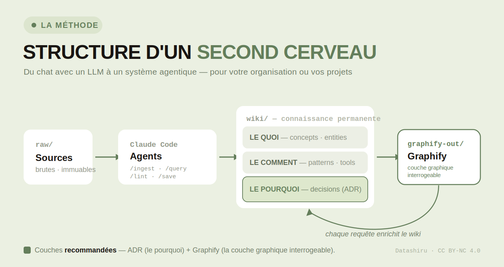

# Obsidian Vault Methodology Template

> **Structure d'un second cerveau : passer du chat avec un LLM à un système agentique pour votre organisation ou vos projets.**

*[English version](README.md)*



Une méthodologie structurée pour construire une **base de connaissances persistante** dans Obsidian, pilotée par des agents Claude Code, avec deux couches **recommandées** — Graphify (graphe de connaissances requêtable) et ADR (journal de décisions). Inspiré des travaux d'Andrej Karpathy sur la mémoire des LLM.

L'idée centrale : au lieu de faire répondre l'IA depuis zéro à chaque conversation, on compile la connaissance de façon permanente dans un wiki. Chaque conversation enrichit la base — rien ne disparaît dans l'historique du chat.

**Auteur** : Nicolas / Datashiru — sous licence [CC BY-NC 4.0](LICENSE).

---

## Les trois piliers de la méthode

### 1. Obsidian — le wiki, ton IDE

Obsidian n'est pas juste un éditeur de notes : c'est l'environnement où la connaissance vit. Chaque page wiki suit une structure fixe (frontmatter, TL;DR, limites et contre-exemples, relations), et les liens `[[wikilinks]]` tissent le graphe explicite entre les notes. Obsidian reste l'outil de navigation et d'édition humaine.

### 2. Claude Code — l'agent qui compile la connaissance

Claude Code joue le rôle de programmeur : le wiki est sa base de code (Markdown), Obsidian son IDE. Quatre commandes structurent le cycle de vie de la connaissance :

- `/ingest` — transforme une source brute (`raw/`) en pages wiki structurées
- `/query` — répond depuis le wiki, pas depuis la connaissance générale du modèle
- `/lint` — vérifie la santé du vault (orphelins, doublons, liens cassés, contenu obsolète)
- `/save` — cristallise une réponse de session en page wiki permanente

Chaque commande délègue à un sous-agent isolé qui ne reçoit que le contexte nécessaire à sa tâche (~40% de tokens économisés par rapport à un agent unique qui charge tout le vault).

### 3. Graphify — le graphe de connaissances queryable (recommandé)

Au-delà d'un certain volume, relire l'intégralité du wiki à chaque question devient lent et coûteux. [Graphify](https://github.com/Graphify-Labs/graphify) indexe le vault dans un graphe (`graphify-out/graph.json`) : nœuds, relations explicites et déduites, communautés détectées.

Le skill **"Read Graph"** — documenté dans un `AGENTS.md` à la racine, lisible par n'importe quel agent (pas seulement Claude Code) — impose un protocole en 3 étapes : consulter le graphe d'abord, identifier les fichiers pertinents, puis lire sélectivement le contenu complet uniquement si nécessaire. Cette technique diminue la consommation de tokens par rapport à une lecture directe de l'ensemble des fichiers.

Cette couche permet aussi un accès **multi-agents** cohérent : plusieurs agents (Claude Code local, un agent sur VPS, etc.) peuvent consulter le même graphe et répondre depuis la même structure, via une synchro Git en lecture seule plutôt qu'une exposition réseau.

---

## Ce que contient le template

- **Architecture** — une structure en couches (`raw/`, `wiki/`, `context/`, `daily/`, `projects/`, `graphify-out/` optionnel)
- **4 slash commandes** — `/ingest`, `/query`, `/lint`, `/save`
- **3 agents spécialisés** — chaque agent reçoit uniquement le contexte dont il a besoin
- **Structure de page wiki** — frontmatter, TL;DR, limites et contre-exemples, relations
- **Couche décisions (ADR)** — recommandée : trace le *pourquoi* des choix (contexte, options rejetées, conséquences), avec la commande `/adr`
- **Conventions de nommage** — listes de tags fermées, kebab-case, préfixes de date ISO
- **Skill Read Graph** — protocole de lecture du graphe, agent-agnostique via `AGENTS.md`
- **Checklist d'initialisation** — pas à pas de zéro à la première ingestion
- **Règles de split de vault** — quand créer un nouveau vault (seuil thématique + plafond technique de 500 pages)

---

## Comment l'utiliser

1. Copier `vault-methodology-template.md` à la racine de ton vault Obsidian
2. Commencer par `context/ligne-rouge.md` — écrire ta contrainte irréductible pour ce vault
3. Suivre la checklist d'initialisation en bas du template
4. Adapter les exemples au domaine
5. (Recommandé) Activer les couches ADR puis Graphify une fois le socle maîtrisé — voir « Étape 5 » et les sections dédiées dans `vault-methodology-template.md`

> Le template est volontairement agnostique du domaine. Adapte-le à ton métier.

---

## Philosophie

```
Source → Ingestion → Wiki → Query → Synthèse → Wiki (enrichi)
```

La connaissance s'accumule de façon exponentielle. Un vault utilisé pendant 6 mois devient exponentiellement plus utile qu'un vault utilisé pendant 6 jours — parce que chaque requête s'appuie sur les ingestions précédentes.

---

## Licence

[CC BY-NC 4.0](LICENSE) — libre d'usage et d'adaptation, attribution obligatoire, usage commercial interdit.
